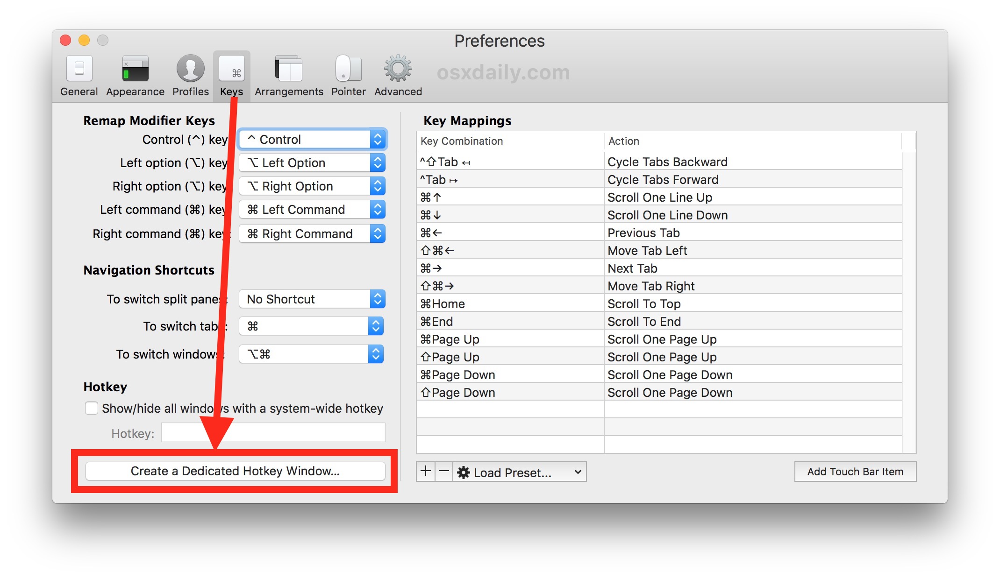
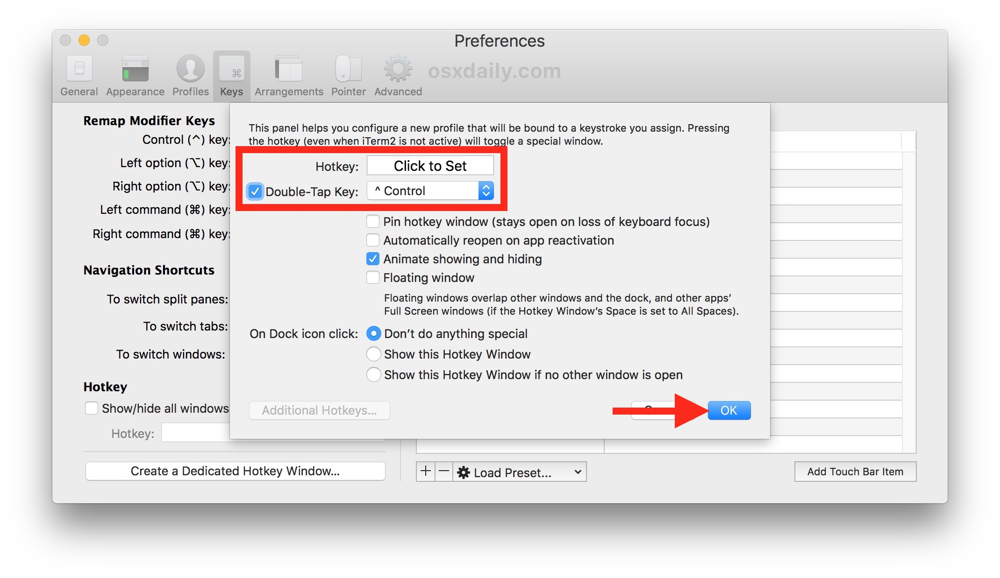

# Setting Up A Dev Environment

A guide to setting up a full-stack web development environment on macOS.

## brew

### Why Install Homebrew?

Homebrew (or just `brew`) is a command-line software installer. Think of an app store, except with a lot more software, and without the graphics.

Features:

- The ONLY tool for getting many important coding tools.
- Very fast single-source installation... anything we can install through `brew`... we will!
- A selection carefully curated by volunteer coders for quality security, but not subservient to any one company's interest (like most app stores are).
- While it takes more knowledge to use than a graphical app store, it takes far less than installing "from source" (using the actual code files to install.

### How Do I Install brew?

[The Homebrew front page](https://brew.sh/) has a one-line command to copy-and-paste into your terminal.

**Important:** Again, don't forget to skip the `$` at the start of the command it gives you! (I hate that people present terminal commands that way.) At least this one provides a copy-to-clipboard icon that DOESN'T include the `$`...

### What KINDS Of Apps Will We Install Through `brew`?

Both graphical interface apps, like web browsers and a text editor, and terminal interface tools, like `git` and `node`.

Non-terminal apps must be installed with the command `--cask`, while terminal tools should not use that command.

### What _Specifically_ Will We Install Through `brew`?

Here are the apps we'll install momentarily, as well as a brief description of why we'll be doing so.

In the meantime, do not install anything! This will all go more smoothly if we install through `brew` in one step.

##### Visual Studio Code

The absolute premier text editor and development environment for many programming languages, most especially JavaScript and TypeScript. User-friendly for beginners, but grows into a powerful dev environment preferred by most front-end engineers.

##### Node

A JavaScript environment run locally through the terminal, this is the tool that's made JavaScript into the powerhouse it is. The back end of the majority of the internet is written in JavaScript and run on Node servers. (Who run the world? Node.)

##### Git

The industry standard for saving your code to the cloud, collaborating on software projects from small to world-eatingly huge, and managing software releases. All from the terminal.

##### iTerm2

One of the best terminal emulators on the Mac, and definitely the one recommended for new devs.

##### Firefox and Chrome (if you don't have them already)

It's vital that we test our Web Apps in both a variety of browsers and in the browsers that our users tend to use (mostly Chrome).

If you dislike Chrome, you can install the Chromium browser (a de-googled Chrome) or Brave, a privacy-focused browser built on Chromium.

### Okay, Let's Install All The Things!

Type (or copy-paste) this into your terminal:

`brew install git node`

Then hit enter, and when it's done, type the following command (and hit enter again):

`brew install --cask google-chrome firefox visual-studio-code iterm2`

If you prefer Brave or Chromium, you can substitute `chromium` or `brave-browser` for `google-chrome` in the above line. (Or put them all in?)

## Oh My Zsh

### Why Install Oh My Zsh?

Your terminal is... not pretty. The default look of bash or zsh can make it very difficult to read. This is actually way more important than it might sound, because being able to quickly read and understand what's going on in your terminal is vital to being comfortable and productive as a developer, because "the command line" is the main way coders interact with local and remote computers.

Oh My Zsh will:

- Make your terminal's data dump much easier to customize.
- Comes out of the box with a great color scheme and prompt setup.
- Has better tab completion to help you avoid typing long file paths.
- Has many amazing extensions, like auto-suggesting previous commands.

### How To Install Oh My Zsh

[Oh My Zsh's homepage](https://ohmyz.sh/) has a one-line command to copy-and-paste into your terminal. Scroll down a bit on that page, or hit the `Install oh-my-zsh` button to have your browser do it for you.

**Important:** Don't forget to skip the `$` at the start of the command it gives you! This is simply meant to indicate that you should be at a terminal prompt when you type the command in, but can be confusing if you don't know that and try to type in that dollar sign. It won't work if you do!

### Potential Next Steps

You can always spruce up your terminal with Oh My Zsh's themes, plugins, and extensions. This author has [a theme](https://www.github.com/abbreviatedman/dangerroom) meant to simplify your prompt, and the [Powerlevel10K](https://github.com/romkatv/powerlevel10k) theme has many great features and is endlessly customizable--though it does take a small amount of extra setup. There are many plugins you can find out there, but the [autosuggestions](https://github.com/zsh-users/zsh-autosuggestions) and [syntax highlighting](https://github.com/zsh-users/zsh-syntax-highlighting) plugins are the first two we'd recommend.

## Moving Your Control Keys

Control is a an uncommonly-used key on the Mac, but it is used QUITE often in the terminal. You know what key isn't used often? (Or shouldn't be!) Caps Lock. (Stop yelling!) So let's swap them!

- Go to your system preferences and choose "Keyboard".
- Press the button "Modifier Keys..." (It's in the lower right.)
- In the Caps Lock menu, choose Control.
- Optional, if you really love Caps Lock: choose Caps Lock under the Control menu.

## Adding A Terminal Drop-Down

Having your terminal be available at all times is really vital. The less friction between you and entering a command, the less you'll lose your flow with what you're doing, and, if you're a beginner, the more practice you'll get with the terminal.

Having a terminal that doesn't even require you switching our of your current app is the best way to do that, so let"s make a drop-down terminal in iTerm2!

### Step 1 - Creating The Drop-Down



Choose Preferences from the menus at the top of iTerm2 ("Preferences" is launched via Command-, in almost any Mac App!), then press the "Keys" tab at the top, then the Hotkey tab below THAT, and press the "Create A Dedicated Hotkey Window..." button at the bottom.

### Step 2 - Configuring The Drop-Down



Do **NOT** press OK until you're completely done with EACH of the bullet points below. No matter what the image above indicates!

- Decide on a hotkey to launch the terminal. Double-tapping Control is a popular one, as is Control-Space. Together with moving your Control key in the prebious secton, this will make launching your terminal a very quick shortcut that won't even take your fingers off the home row (ASDFJKL;).
- Check "Double-Tap Key" and choose the modifier key from the menu if you want a double-tap solution, or press "Click To Set" and enter your own shortcut, if that's your preference.
- **Check the Floating window** box. This makes sure your window doesn't change apps for you. This is annoying

## Git Configuration

For git, you'll need a bit of configuration to "log in" (that's not technically QUITE what it's doing, but close enough).

Enter the following commands in bash. Remember that:

- you'll skip the backticks and "sh" if you're reading this as markdown,
- and the square brackets in code documentation means that you're not literally going to write "your name here". You're going to see this format a lot, and you're going to get used to replacing the square brackets with its meaning; in this case, your actual name. I would put: git config --global user.name "Colin Jaffe"

```sh
git config --global user.name "[your name here]"
git config --global user.email "[your email here]"
```

## VS Code Extensions

To get the most out of Visual Studio Code, you'll want to use extensions. These are bits of extra functionality written in JavaScript/HTML/CSS. To add extensions, go to the Extensions menu on the left sidebar; it has an icon of four squares, one apart from the others. (You can also press Command-Shift-X.)

Here are our recommended extensions and why we're using them!

### Essential Extensions

- Live Server - runs your current directory as a page in your browser, reloading every time the code changes.
- Quokka - Evaluates JavaScript as you type.
- Bracket Pair Colorizer 2 - Makes any missing brackets (`()`, `[]`, `{}`) much much easier to see.
- Code Spell Checker - Let's not let simple typos ruin our code. We can do that well enough ourselves, THANK YOU.
- Indent Rainbow - Makes your indentation level much easier to see.

### Optional Extensions

- Settings Sync - Sync your settings to GitHub. Takes a minute to set up, but if your computer breaks down or you just switch machines, it will re-install all your other extensions, themes, settings, snippets, and so on automatically.
- Markdown All-In-One - Some nice shortcuts and standard-of-living adjustments for writing Markdown.

## Jest

We'll be using this JavaScript library heavily, and soon, so we'll use Node (and its package manager `npm` to install it:

```sh
npm install --global jest
```

## Congratulations!

You are now a master coder! Or, at least... you have the setup of one!
